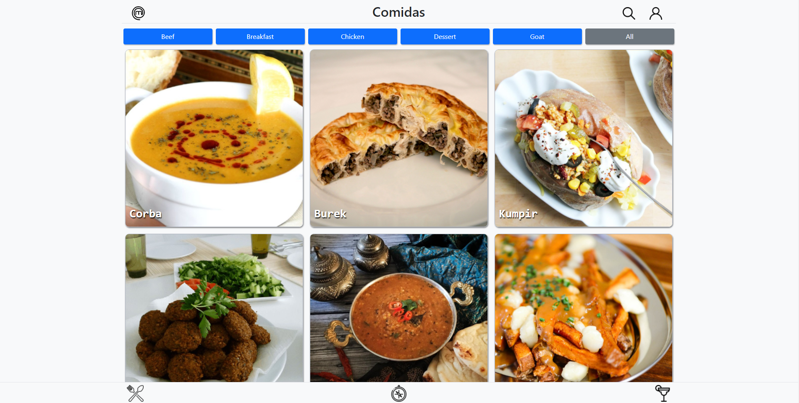

<h1 align="center"> Recipes App </h1>

 Link para a aplicação: <a href=https://benedetti14.github.io/RecipesApp/>Recipes App</a> 

O projeto consistia em desenvolver um aplicativo de receitas, onde seria possivel acompanhar receitas favoritas, procurar por receitas com ingredientes específicos, entre outras funções. Um projeto desenvolvido em grupo, onde desenvolvemos, além das habilidades técnicas, habilidades interpessoais.

<h2> Como rodar o projeto no terminal </h2>

1. Clone o projeto `git clone git@github.com:benedetti14/RecipesApp.git`
2. Entre no diretório `cd RecipesApp`
3. Instalar as depêndencias `npm install`
4. Rodar a aplicação `npm start`
5. Acessar a aplicação `http://localhost:3000`

<h2> Tecnologias </h2>

* React
* Hooks
* Context API
* Bootstrap
